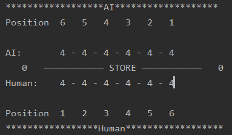

# Mancala

**Environment requirement:** python 3.7

**run:** running run_game.py

## Board

- AI: Side of AI
- Human: Side of Human
- Store: The stones store for Human & AI. The left one is for AI, The right one is for Human.
- Position: the corresponded position for every side.

## Operation

- Do you want to go first? 0 is first, 1 is second, 2 is exit

This is the begin text, 0 means human first and AI second, 1 means AI first and human second, 2 means exit

- Human Move(q means exit the game):

This is the command which shows you to choose a position to move. if it is not a valid position following rule, console will show that rong Move 9, Please Try Again (1-6)  

